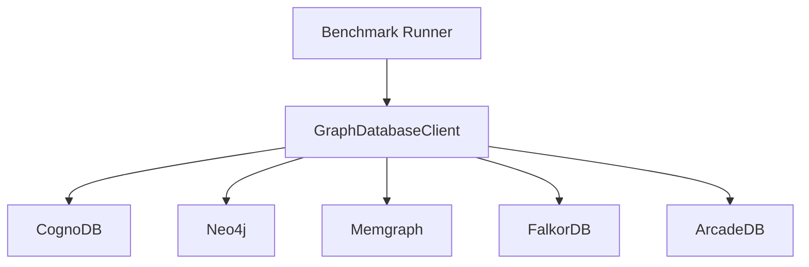

# Graph Database Cloud Benchmark

A reproducible Java benchmark harness for comparing CognoDB Cloud with Neo4j, Memgraph, FalkorDB, and ArcadeDB using the same Cypher-shaped workloads and the SNAP soc-Pokec sample.

This repository reports measurements; it does not claim that one database universally wins. Network distance, free-tier throttling, query compatibility, and instance sizing can materially affect results.

## Current status

The harness implements the assignment's required workload categories:

- dataset sanity counts and indexed `User.id` point lookup
- 1-hop, 2-hop, and 3-hop traversals
- count, relationship-count, and top-degree aggregations
- concurrent read/write throughput with configurable reader count and mix
- warm-up iterations, measured iterations, failures, p50 and p95 latency
- raw CSV output plus dependency-free normalization and SVG chart generation

The checked-in `results/` directory contains example output. Replace it with a fresh run before submitting measured claims.

## Dataset

The input is the public SNAP soc-Pokec social network sample in `data/soc-Pokec-200k.txt`. The preprocessing tool removes blank/comment lines and duplicate directed edges into `data/soc-pokec-relationships.txt`. Run the loader/preprocessor for the exact counts used in a run and record those counts with the results.

Every platform must receive the same relationship file. The Neo4j-compatible clients use driver batching with `UNWIND`, `MERGE (u:User {id: ...})`, and `:FRIEND` relationships. Do not compare runs with different files, indexes, client machines, regions, or query settings.

## Requirements and fairness

Use the smallest common resource envelope. The CognoDB c0 tier is advertised as burstable 0.5 vCPU, 256 MB RAM, and 1 GB disk. The local comparison services in `docker/docker-compose.yml` are development substitutes and must be capped/documented before a result is described as cloud-equivalent. Record the actual platform tier, vCPU, RAM, disk, region, client host, Java version, Docker image digest, and date in the report.

| Platform | Harness client | Default endpoint | Resource note |
| --- | --- | --- | --- |
| CognoDB Cloud | `CognoDbClient` | `COGNODB_URI` | c0 details must be recorded |
| Neo4j | `Neo4jClient` | `bolt://localhost:17687` | local container unless replaced |
| Memgraph | `MemgraphClient` | `bolt://localhost:17688` | local container; point lookup is filtered because index DDL is unavailable through this adapter |
| FalkorDB | `FalkorDbClient` | `localhost:6379` | RedisGraph API; index DDL is not included in the shared workload |
| ArcadeDB | `ArcadeDbClient` | `bolt://localhost:7689` | local container unless replaced |

A local endpoint is not evidence of a managed-cloud comparison. State this limitation plainly when using Docker.

## Run

1. Copy `.env.example` to `.env` and set `COGNODB_URI`, `COGNODB_USERNAME`, and `COGNODB_PASSWORD`. These are the only variables required for the final CognoDB baseline. The optional `NEO4J_*`, `MEMGRAPH_*`, `FALKORDB_*`, and `ARCADEDB_*` entries document local comparison connection points only; the archived comparison attempts used Docker defaults and are not part of the final run. Never commit `.env`, passwords, or connection URIs.
2. Start local comparison services only when testing them: `docker compose -f docker/docker-compose.yml up -d`.
3. Compile and run the complete CognoDB suite:

```powershell
.\mvnw.cmd clean test
.\mvnw.cmd exec:java "-Dexec.mainClass=com.wexa.benchmark.Main"
```

The default run uses 10 warm-up and 100 measured iterations. Configure the run without source edits:

```powershell
$env:BENCHMARK_WARMUP="10"
$env:BENCHMARK_ITERATIONS="100"
$env:BENCHMARK_READERS="10"
$env:BENCHMARK_READ_OPERATIONS="100"
$env:BENCHMARK_WRITE_OPERATIONS="100"
.\mvnw.cmd exec:java "-Dexec.mainClass=com.wexa.benchmark.Main"
```

The application initializes `results/traversal.csv`, `results/point_lookup.csv`, `results/aggregation.csv`, and `results/concurrent_read_write.csv` for each run. It creates the `User.id` index before measuring. The measured latency is client-observed wall-clock time and includes network and driver overhead.

Normalize raw CSVs and create the chart:

```powershell
python scripts/analyze_results.py
```

This writes `results/normalized.csv` and `results/p95_latency.svg`.

## Comparison archive

The Docker comparison campaign was not completed under one fair, reproducible configuration. Historical observations, timing notes, batch-size experiments, and the client architecture are recorded in [reports/COMPARISON_SNAPSHOT.md](reports/COMPARISON_SNAPSHOT.md). They are disclosed for transparency, not used for final winner claims.

### Client Architecture



## Required result matrix

Before publication, fill this table from fresh runs for every platform. Do not replace failed or unavailable measurements with zeros; use `not run`, `timeout`, or `not observable` and explain why.

| Category | Metric | CognoDB | Neo4j | Memgraph | FalkorDB | ArcadeDB |
| --- | --- | ---: | ---: | ---: | ---: | ---: |
| Loading | nodes/s, relationships/s, wall-clock | 7.991 / 17.468 / 11,449.31 sec | not run | not run | not run | not run |
| Traversal | 1-hop p50/p95 ms | 776.877 / 1226.192 | not run | not run | not run | not run |
| Traversal | 2-hop p50/p95 ms | 797.176 / 1090.261 | not run | not run | not run | not run |
| Traversal | 3-hop p50/p95 ms | 795.984 / 965.905 | not run | not run | not run | not run |
| Lookup | indexed point p50/p95 ms | 813.331 / 921.602 | not run | not run | not run | not run |
| Aggregation | count/group-by p50/p95 ms | 788.753–1331.120 / 923.273–1395.107 | not run | not run | not run | not run |
| Mixed workload | QPS, concurrency, read/write mix | 5.866 QPS; 4 readers + 1 writer | not run | not run | not run | not run |
| Footprint | data size, memory, instance specs | documented below | not observable | not observable | not observable | not observable |

## Analysis and caveats

Write the final analysis only after collecting repeated runs. Include median and p95, run-to-run variation, failed operations, cold-start observations, resource/cost assumptions, and why query-language or feature differences may influence a result. A latency number without its tier, region, dataset counts, index state, warm-up policy, and client location is not reproducible evidence.

The loading and normalized summaries are emitted as `reports/cognodb_summary.csv` and `reports/cognodb_normalized.csv`. The local Docker services are not part of the final claims and are not equivalent managed-cloud tiers.

## License and source

The dataset is from the Stanford Network Analysis Project (SNAP) soc-Pokec collection. Follow the dataset's terms and cite its source in the final public repository.


## Benchmark Metrics

The benchmark measures the following workloads and metrics on each graph
database platform.

| Category | Workload | Metrics |
|---|---|---|
| Data Loading | Dataset ingestion | Nodes/sec, relationships/sec, total wall-clock load time |
| Traversal | 1-hop traversal | p50 latency (ms), p95 latency (ms) |
| Traversal | 2-hop traversal | p50 latency (ms), p95 latency (ms) |
| Traversal | 3-hop traversal | p50 latency (ms), p95 latency (ms) |
| Lookup | Point lookup | p50 latency (ms), p95 latency (ms) |
| Lookup | Indexed/filtered lookup | p50 latency (ms), p95 latency (ms), indexed properties |
| Aggregation | Count / GROUP BY style query | p50 latency (ms), p95 latency (ms) |
| Mixed Workload | Concurrent reads/writes | Sustained queries/sec, client concurrency, read/write mix |
| Footprint | Resource usage | Stored data size, memory usage, instance specifications |


## CognoDB Results

### Environment

- Platform: CognoDB Cloud
- Tier: Free
- Measured iterations: 100 for read workloads
- Latency measurement: client-observed end-to-end latency through the Neo4j Java driver

### Data Loading

| Metric | Result |
## Result matrix

The completed submission is a CognoDB-only baseline. The four comparison services were not completed reproducibly before the deadline and are deliberately marked `not run`; their partial files were removed during cleanup.
| Load time | 11,449.31 sec |
| Node throughput | 7.991 nodes/sec |
| Relationship throughput | 17.47 relationships/sec |

### Traversals

| Workload | p50 (ms) | p95 (ms) |
|---|---:|---:|
| 1-hop | 776.88 | 1226.19 |
| 2-hop | 797.18 | 1090.26 |
| Loading | nodes/s, relationships/s, wall-clock | 7.991 / 17.468 / 11,449.31 sec | not run | not run | not run | not run |
| Traversal | 1-hop p50/p95 ms | 776.877 / 1226.192 | not run | not run | not run | not run |
| Traversal | 2-hop p50/p95 ms | 797.176 / 1090.261 | not run | not run | not run | not run |
| Traversal | 3-hop p50/p95 ms | 795.984 / 965.905 | not run | not run | not run | not run |
| Lookup | indexed point p50/p95 ms | 813.331 / 921.602 | not run | not run | not run | not run |
| Aggregation | count/group-by p50/p95 ms | 788.753–1331.120 / 923.273–1395.107 | not run | not run | not run | not run |
| Mixed workload | QPS, concurrency, read/write mix | 5.866 QPS; 4 readers + 1 writer | not run | not run | not run | not run |
| Footprint | data size, memory, instance specs | documented below | not observable | not observable | not observable | not observable |
| 3-hop | 795.98 | 965.91 |

### Lookup

| Workload | p50 (ms) | p95 (ms) | Indexed property |
The loading and normalized summaries are emitted as `reports/cognodb_summary.csv` and `reports/cognodb_normalized.csv`. The local Docker services are not part of the final claims and are not equivalent managed-cloud tiers.
| Point lookup | 813.33 | 921.60 | `User.id` |
| Indexed lookup | Not separately measured | Not separately measured | `User.id` |

### Aggregations

| Workload | p50 (ms) | p95 (ms) |
|---|---:|---:|
| User count | 788.75 | 1264.52 |
| Relationship count | 920.81 | 923.27 |
| Top degrees | 1331.12 | 1395.11 |

### Mixed Workload

| Concurrency | Read/Write Mix | Queries/sec | p50 (ms) | p95 (ms) |
|---:|---|---:|---:|---:|
| 4 readers + 1 writer | 500 total operations | 5.866 | 748.950 | 1198.380 |

### Footprint

| Resource | Result |
|---|---|
| Storage | 828 MB / 1 GiB observed |
| Memory | 512 MB observed |
| vCPU | 0.5 burst observed |
| Instance tier | Free |


## Submission status

The reproducible CognoDB baseline is complete and documented in [reports/FINAL_REPORT.md](reports/FINAL_REPORT.md). The historical comparison snapshot is documented in [reports/COMPARISON_SNAPSHOT.md](reports/COMPARISON_SNAPSHOT.md). The root `results/*.csv` files are the original CognoDB baseline. Incomplete Docker comparison artifacts were removed during cleanup.

Generated CognoDB artifacts:

- `reports/cognodb_normalized.csv`: normalized p50/p95 result matrix
- `reports/cognodb_summary.csv`: load and throughput summary
- `reports/cognodb_p95_latency.svg`: p95 latency chart

Generate them with:

```powershell
python scripts/build_cognodb_report.py
```
