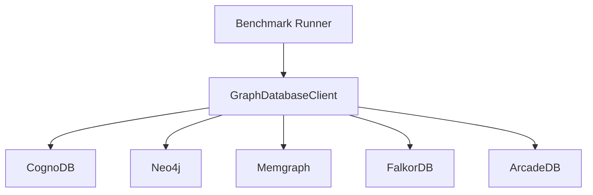

# Comparison Snapshot: Historical Attempts

This file records metrics observed during database comparison attempts. The data is intentionally labeled **not fully correct / not directly comparable** and must not be used for winner claims.

## Why The Data Is Not Final

- CognoDB completed baseline: 200,000 relationships, batch size 500, 10 warm-ups, 100 read iterations.
- Neo4j attempt: approximately 188,500 relationships and a different smoke configuration.
- Memgraph attempt: 100,000 relationships, batch size 100, 2 warm-ups, 10 read iterations.
- ArcadeDB attempt: 100,000 relationships, batch size 100, 2 warm-ups, 10 read iterations.
- FalkorDB: no completed benchmark metrics.
- Comparison databases were local Docker deployments, not equivalent managed cloud tiers.
- Some attempts were interrupted or had service connection failures; only successful rows are shown below.

## Observed Metrics

Latency values are p50/p95 in milliseconds. These values are historical observations from terminal output, not the final normalized comparison matrix.

| Platform / dataset | 1-hop | 2-hop | 3-hop | Point lookup | User count | Relationship count | Top degrees | Concurrent |
| --- | ---: | ---: | ---: | ---: | ---: | ---: | ---: | ---: |
| CognoDB, 200k | 776.877 / 1226.192 | 797.176 / 1090.261 | 795.984 / 965.905 | 813.331 / 921.602 | 788.753 / 1264.520 | 920.808 / 923.273 | 1331.120 / 1395.107 | 5.866 QPS; p95 1198.380 |
| Neo4j, ~188.5k | 21.175 / 25.923 | 22.327 / 23.469 | 27.585 / 36.689 | 26.858 / 85.280 | 26.037 / 82.249 | 38.259 / 70.651 | 272.382 / 446.559 | 41.990 QPS; p95 330.290 |
| Memgraph, 100k | 26.417 / 35.795 | 24.943 / 52.846 | 24.404 / 43.960 | 28.002 / 53.911 | 20.605 / 23.375 | 35.072 / 44.294 | 64.855 / 136.232 | 49.322 QPS; p95 66.537 |
| ArcadeDB, 100k | 993.450 / 1549.769 | 932.755 / 2297.159 | 582.402 / 1090.983 | 311.604 / 1361.447 | 200.373 / 275.653 | 250.235 / 344.309 | 97.710 / 132.039 | 9.393 QPS; p95 480.719 |
| FalkorDB | not completed | not completed | not completed | not completed | not completed | not completed | not completed | not completed |

## Timing And Batch Experiments

| Run / observation | Batch size | Timing |
| --- | ---: | --- |
| CognoDB completed baseline | 500 | Load time 11,449.31 seconds, approximately 03:11 hours |
| Historical comparison import log | 500 | Log reported `9:58:48 PM`; Maven reported `Total time: 03:11 h`; finished around `2026-08-20 01:10 +05:30` |
| Comparison experiments | 100 and 500 | Different batch sizes were tried while diagnosing Bolt disconnects and slow local imports |

The timing rows are retained as reported in the terminal logs. They should be treated as wall-clock/import observations, not precise apples-to-apples performance results.

## Architecture

Use [FINAL_REPORT.md](FINAL_REPORT.md) for the authoritative CognoDB submission. This snapshot exists only to disclose what was attempted and observed.
