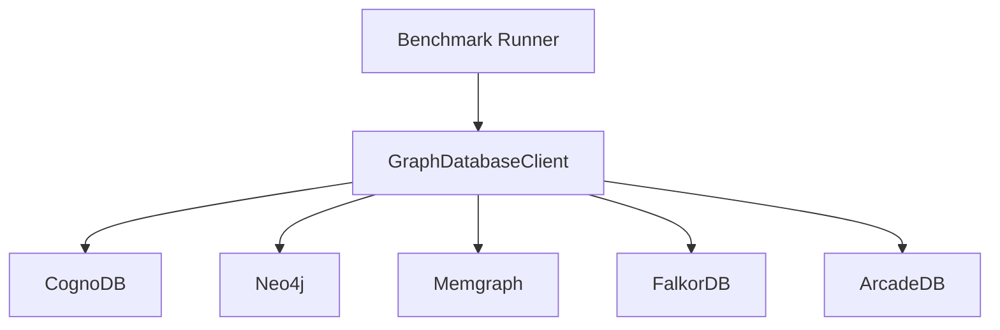

# CognoDB Benchmark Final Report

## Scope

This report presents the completed CognoDB benchmark baseline from the existing run. The four Docker comparison runs are not included in the final claims because they did not all complete with the same dataset and reproducible metadata before the submission deadline.

Historical comparison observations, timing notes, and batch-size experiments are disclosed in [COMPARISON_SNAPSHOT.md](COMPARISON_SNAPSHOT.md). They are not used as a directly comparable ranking.

## Architecture



## Dataset and environment

- Dataset: SNAP soc-Pokec sample
- Nodes: 91,489
- Relationships: 200,000
- Load batch size: 500 relationships
- Load time: 11,449.31 seconds
- Reported terminal timing: batch size 500; approximately 03:11 hours; log time 9:58:48 PM and Maven finish around 2026-08-20 01:10 +05:30
- Node throughput: 7.991 nodes/second
- Relationship throughput: 17.468 relationships/second
- Warm-up: 10 iterations
- Read measurements: 100 iterations
- Latency: client-observed wall-clock time through the Neo4j Java driver
- Indexed property: `User.id`
- Platform: CognoDB Cloud free tier

## Results

| Workload | p50 (ms) | p95 (ms) | Successful | Failed |
| --- | ---: | ---: | ---: | ---: |
| 1-hop traversal | 776.877 | 1226.192 | 100 | 0 |
| 2-hop traversal | 797.176 | 1090.261 | 100 | 0 |
| 3-hop traversal | 795.984 | 965.905 | 100 | 0 |
| Point lookup | 813.331 | 921.602 | 100 | 0 |
| User count | 788.753 | 1264.520 | 50 | 0 |
| Relationship count | 920.808 | 923.273 | 50 | 0 |
| Top degrees | 1331.120 | 1395.107 | 50 | 0 |
| Concurrent read/write | 748.950 | 1198.380 | 500 | 0 |

The concurrent baseline used four reader threads, one writer thread, 500 total operations, and achieved 5.866 successful operations/second.

## Interpretation

The measured CognoDB run completed every recorded workload without failed operations. Traversal depths were similar in this run, while the top-degree aggregation was the slowest read workload. The point lookup includes client and network overhead and should not be interpreted as server-only execution time.

The load phase was much slower than the read workloads because it used driver-side batched `MERGE` operations over a cloud connection. Load throughput is therefore a combined measure of database writes, transaction processing, network latency, and client behavior.

## Limitations and caveats

- This is a baseline, not a fair cross-platform comparison. Other database runs were incomplete or used different dataset sizes.
- The traversal start-node selection was deterministic rather than a statistically random sample, so traversal results are preliminary for the assignment's random-start requirement.
- The footprint values are platform-observed estimates and should be replaced with console-exported values where available.
- Free-tier throttling, cloud-region distance, network variance, and burstable CPU can affect latency.
- The benchmark adds `BENCHMARK_WRITE` relationships during the concurrent workload; this workload is intentionally measured separately from the read-only results.
- No claim is made that CognoDB is universally faster or slower than another database.

## Reproduction

Use the existing `.env` configuration for CognoDB and run:

```powershell
.\mvnw.cmd clean test
.\mvnw.cmd exec:java "-Dexec.mainClass=com.wexa.benchmark.Main"
python scripts/build_cognodb_report.py
```

Do not commit `.env`, passwords, or connection URIs. The previously attempted comparison containers and partial CSVs should be treated as disposable artifacts, not published evidence.
